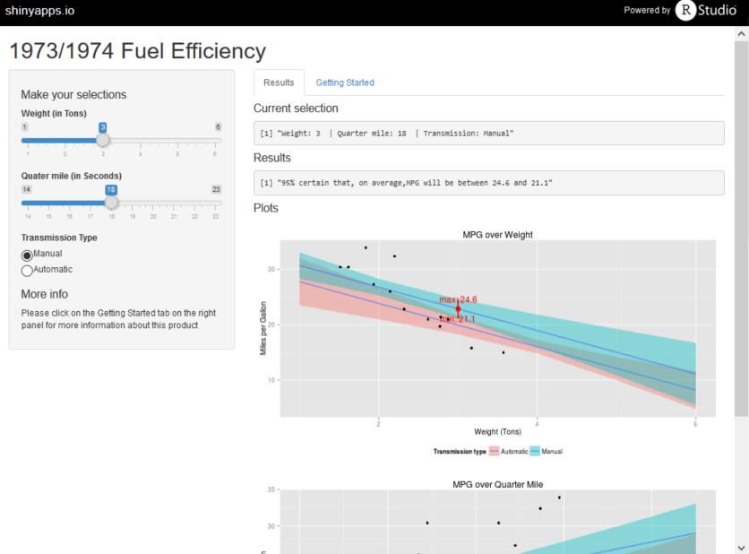
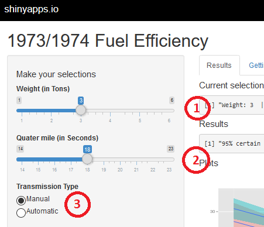

## 1973/1974 Fuel Efficiency App 

<div style='text-align: center;'>
  <font size="6">Welcome to the pitch presentation!</font>
  <p>
  
  <p>
  <font size="5"><p>App and deck by: <b>Edgar Ruiz</b></font>
  
  <font size="4"><p>September 2015</font>
</div>

---
## What makes this app interesting?

* It illustrates how to we can use a sample data to get an idea of what the true value of the population will be. 
* Because its interactive.  It has 3 controls that enables the user to see how each automobile feature interacts
* The prediction model was selected after considerable data exploration and careful feature selection.  The levelplot below is an example of one of the plots used the selection process.
```{r, echo=FALSE, results='hide',warning=FALSE}
library(lattice)
```

```{r, fig.width=6, fig.height=4,fig.show='hold', echo=FALSE}
mtcars.cor <- abs(cor(mtcars))
mtcars.cor[1,1]=0;mtcars.cor[2,2]=0;mtcars.cor[3,3]=0;mtcars.cor[4,4]=0;mtcars.cor[5,5]=0;mtcars.cor[6,6]=0
mtcars.cor[7,7]=0;mtcars.cor[8,8]=0;mtcars.cor[9,9]=0;mtcars.cor[10,10]=0;mtcars.cor[11,11]=0
mtcars.palette <- colorRampPalette(c("white", "green", "yellow", "red"), space = "rgb")

levelplot(mtcars.cor,col.regions=mtcars.palette(120), xlab="", ylab="", colorkey=list(space="bottom", width=0.5, labels=list(cex=0.9)), aspect="fill", main=list("MTCARS - Dataset correlation" , sub="Dataset correlation",cex=0.9), scales=list(cex=0.9))
```

--- 
## How does it work?

* The model uses Weight, Seconds the car takes to run a Quarter Mile and Transmission type (Manual or Auto) to determine average MPG.  The variables are run in a standard Linear Model in R.
* The code and resulting figure below shows the 'residual' analysis of the model, to confirm that the model can be used for our project

```{r fig.width=8, fig.height=3}
m <- lm(mpg~wt+qsec+am, data=mtcars)
par(mfrow=c(1,2))
plot(m$fitted.values~m$residuals, col="red")
qqnorm(m$residuals);qqline(m$residuals, col="red")
```

---
## What does the results tell me?

* The plots represent where the model says that the true mean of MPG will be, with a 95% degree of confidence
* It shows to 'cones' that represent the simulation using several consecutive discrete values
* The simulation below shows what this plot sill look like if Quarter Mile is set to 18, Weight to 3 and Transmission to Manual.  In red, it displays the max/min range for the selections made.

```{r echo=FALSE, fig.width=4, fig.height=4}
      model <- lm(mpg~wt+qsec+am, mtcars)
      var.qsec <- 18
      var.wt <- 3
      var.am <- 1
      wt.auto <-  predict(model, data.frame(qsec=c(14:23), wt=var.wt,am= 0), interval="conf", level=.95)
      wt.man <-  predict(model, data.frame(qsec=c(14:23), wt=var.wt,am= 1), interval="conf", level=.95)

      wt.frame <- rbind(wt.auto, wt.man)
      rownames(wt.frame) <- c(1:20)
      wt.frame <- as.data.frame(wt.frame)
      wt.type <- c(rep("Auto", times=10), rep("Man", times=10))
      wt.frame <- cbind(wt.frame, wt.type)
      wt.frame <- cbind(wt.frame, rep(c(14:23),tidmes=2))
      rownames(wt.frame) <- c(1:20)
      wt.col <- c("fit", "lwr", "upr","type" ,"qsec") 
      colnames(wt.frame) <- wt.col 
      pred.result <- predict(model, data.frame(qsec=var.qsec, wt=var.wt  , am=var.am), interval="conf", level=.95)
      
      wt.plot <- ggplot(data=wt.frame,aes(x=qsec,y=fit))
      wt.plot <- wt.plot + geom_smooth(aes(ymin=lwr, ymax=upr, fill=factor(type)), data=wt.frame, stat = "identity")
      wt.plot <- wt.plot + annotate("text", label=paste("min:" ,round(pred.result[2],digits=1)), x=var.qsec,y=pred.result[2], colour="red")   
      wt.plot <- wt.plot + annotate("text", label=paste("max:" ,round(pred.result[3],digits=1)), x=var.qsec,y=pred.result[3], colour="red")   
      wt.plot <- wt.plot + annotate("pointrange", x = var.qsec, y = pred.result[1], ymin = pred.result[2], ymax =pred.result[3],colour = "red", size = 1)
      wt.plot <- wt.plot + labs(y="Miles per Gallon", x="Quarter Mile (In Seconds)", title="MPG over Quarter Mile")
      wt.plot <- wt.plot + scale_fill_discrete(name = "Transmission type", labels=c("Automatic","Manual"))
      wt.plot <- wt.plot + theme(legend.position="bottom")
      wt.plot <- wt.plot + geom_point(data=subset(mtcars, am==var.am),mapping = aes(x=qsec, y=mpg))
      plot(wt.plot)
```


---
## How difficult is it to use?

* It's simple! All you have to do is to move the sliders (Red circles 1 & 2 in the figure below) to a value you would like to see rendered or, click on one of the car transmission options(Red circle number 3)
* To help you in your discovery, there is a "Getting Started" tab, right above the graphs that will provide further help
<div style='text-align: center;'>
    
</div>