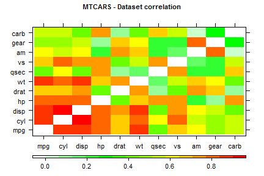
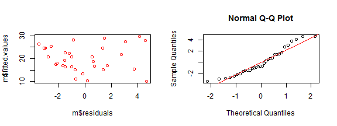
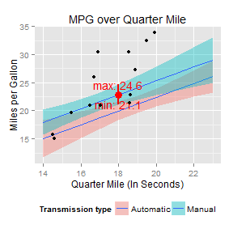

## 1973/1974 Fuel Efficiency App 

<div style='text-align: center;'>
  <font size="6">Welcome to the pitch presentation!</font>
  <p>
  
  <p>
  <font size="5"><p>App and deck by: <b>Edgar Ruiz</b></font>
  
  <font size="4"><p>September 2015</font>
</div>

---
## What makes this app interesting?

* It illustrates how to we can use a sample data to get an idea of what the true value of the population will be. 
* Because its interactive.  It has 3 controls that enables the user to see how each automobile feature interacts
* The prediction model was selected after considerable data exploration and careful feature selection.  The levelplot below is an example of one of the plots used the selection process.


 

--- 
## How does it work?

* The model uses Weight, Seconds the car takes to run a Quarter Mile and Transmission type (Manual or Auto) to determine average MPG.  The variables are run in a standard Linear Model in R.
* The code and resulting figure below shows the 'residual' analysis of the model, to confirm that the model can be used for our project


```r
m <- lm(mpg~wt+qsec+am, data=mtcars)
par(mfrow=c(1,2))
plot(m$fitted.values~m$residuals, col="red")
qqnorm(m$residuals);qqline(m$residuals, col="red")
```

 

---
## What does the results tell me?

* The plots represent where the model says that the true mean of MPG will be, with a 95% degree of confidence
* It shows to 'cones' that represent the simulation using several consecutive discrite values
* The simulation below shows what this plot sill look like if Quarter Mile is set to 18, Weight to 3 and Transmision to Manual.  In red, it displays the max/min range for the selections made.

 


---
## How difficult is it to use?

* It's simple! All you have to do is to move the sliders (Red circles 1 & 2 in the figure below) to a value you would like to see rendered or, click on one of the car transmision options(Red cicle number 3)
* To help you in your discovery, there is a "Getting Started" tab, right above the graphs that will provide further help
<div style='text-align: center;'>
    
</div>
